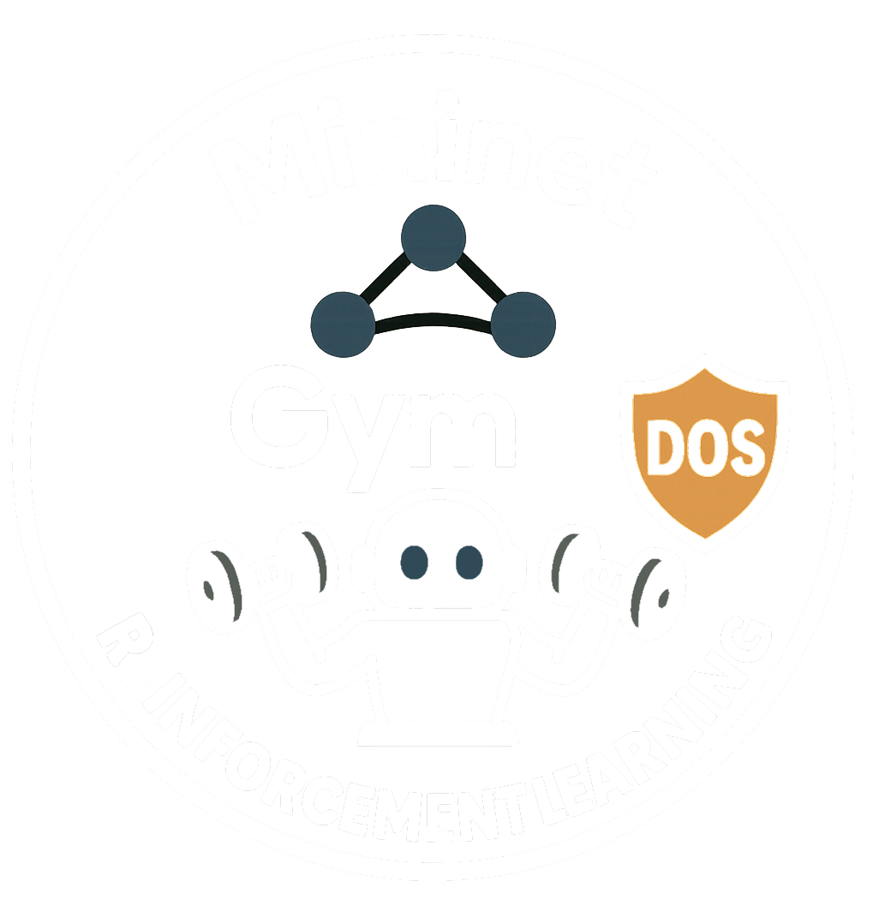

<a id="readme-top"></a>

[![Contributors][contributors-shield]][contributors-url]
[![Forks][forks-shield]][forks-url]
[![Stargazers][stars-shield]][stars-url]
[![Issues][issues-shield]][issues-url]
[![MIT License][license-shield]][license-url]
[![LinkedIn][linkedin-shield]][linkedin-url]

<br />
<div align="center">
  <a href="https://github.com/dipi-unimore/mininet-gym">
    
  </a>

  <h3 align="center">MininetGym</h3>

  <p align="center">
    Reinforcement learning Mininet OpenDayLight
    This project aims to provide a basic framework for DDoS mitigation using reinforcement learning (Deep and not).
    The network is implemented using Mininet (based on Software-Defined networking).
    The design of the solution is inspired by the work "MininetGym: A modular SDN-based simulation environment for reinforcement learning in cybersecurity" by Salvo Finistrella and others here.
    <br />
    <a href="https://www.sciencedirect.com/science/article/pii/S235271102500278X"><strong>Explore the docs »</strong></a>
    <br />
    <br />
    <a href="https://github.com/dipi-unimore/mininet-gym/issues/new?labels=bug&template=bug-report---.md">Report Bug</a>
    ·
    <a href="https://github.com/dipi-unimore/mininet-gym/issues/new?labels=enhancement&template=feature-request---.md">Request Feature</a>
  </p>
</div>

<details>
  <summary>Table of Contents</summary>
  <ol>
    <li>
      <a href="#about-the-project">About The Project</a>
      <ul>
        <li><a href="#built-with">Built With</a></li>
      </ul>
    </li>
    <li>
      <a href="#getting-started">Getting Started</a>
      <ul>
        <li><a href="#prerequisites">Prerequisites</a></li>
        <li><a href="#installation">Installation</a></li>
      </ul>
    </li>
    <li><a href="#usage">Usage</a></li>
    <li><a href="#roadmap">Roadmap</a></li>
    <li><a href="#contributing">Contributing</a></li>
    <li><a href="#license">License</a></li>
    <li><a href="#contact">Contact</a></li>
    <li><a href="#acknowledgments">Acknowledgments</a></li>
  </ol>
</details>

## About The Project

![Schema Screen Shot][schema-screenshot]
Schema 
![Product Screen Shot][product-screenshot]
Web UI

A Modular SDN-based Simulation Environment for Reinforcement Learning in Cybersecurity
Real-time traffic generation and flow monitoring via Mininet and Custom Gym environments for traffic classification and DoS attack detection.

---

## Built With

* [Python](https://www.python.org/)
* [Mininet](http://mininet.org/)
* [OpenDayLight (ODL)](https://www.opendaylight.org/)
* [Gymnasium / OpenAI Gym](https://gymnasium.farama.org/)
* [PyTorch](https://pytorch.org/) / [NumPy](https://numpy.org/)

<p align="right">(<a href="#readme-top">back to top</a>)</p>

---

<p align="right">(<a href="#readme-top">back to top</a>)</p>

## Getting Started

This section provides instructions on how to set up and run the MininetGym project on a clean Ubuntu 20.04+ system.

### Prerequisites

Ensure you have the following installed on your system:
* **Python 3.11** or later
* **Mininet**: A network emulator that creates a network of virtual hosts, switches, controllers, and links.
* **OpenDayLight (ODL)**: A modular open-source platform for Software-Defined Networking (SDN). Java 1.8.0 or later is required for ODL.

### Installation

Follow these steps to get your development environment set up.

1.  **Install Mininet, hping3, and System Dependencies**
   The project requires the **`hping3`** tool for network attack simulation. Make sure it is installed along with Mininet.

    ```bash
    sudo apt update && sudo apt upgrade -y
    sudo apt-get install mininet python3-venv git -y
    
    # Installazione di hping3
    sudo apt-get install -y hping3
    ```
    
    **Verifica e Pulizia:**
    Verification and Cleanup: Run a simple Mininet test and clean the environment to ensure that `hping3` is recognized by the virtual hosts.

    ```bash
    sudo mn --test pingall
    sudo mn -c
    ```
    You can verify the `hping3` installation with: `hping3 --help` or `which hping3`.

2.  **Clone the Repository**
    Create a new directory for your project, navigate into it, and clone your repository.

    ```bash
    mkdir MininetGym
    cd MininetGym
    git clone [https://github.com/dipi-unimore/mininet-gym.git](https://github.com/dipi-unimore/mininet-gym.git)
    cd mininet-gym
    ```

3.  **Create and Activate a Python Virtual Environment**
    It is crucial to use a virtual environment to manage project dependencies and avoid conflicts with system packages. This also prevents the `externally-managed-environment` error.

    ```bash
    # Create a new virtual environment named 'venv'
    python3 -m venv venv

    # Activate the virtual environment
    source venv/bin/activate
    ```
    You will see `(venv)` prepended to your terminal prompt, indicating that the virtual environment is active.

4.  **Install Python Dependencies**
    With your virtual environment activated, install the required Python packages using `requirements.txt`.

    ```bash
    pip install -r requirements.txt
    ```
    If you encounter an error related to `ale-py`, you may need to update the version in the `requirements.txt` file (e.g., to `ale-py>=0.11.0`).

5. **Troubleshooting: libcudnn.so Errors**
    If you encounter an error like `ImportError: libcudnn.so.9: cannot open shared object file: No such file or directory`, it means that your PyTorch installation is configured to use NVIDIA GPU acceleration but cannot find the necessary libraries. You have two options to resolve this:

    Option A: Install the CPU-only version of PyTorch (Recommended)
    This is the simplest and safest solution, especially if you do not have a dedicated NVIDIA GPU. It avoids the need for any CUDA or cuDNN libraries.

    ```bash
    pip uninstall torch
    pip install torch torchvision torchaudio --index-url https://download.pytorch.org/whl/cpu
    ```    

    Option B: Install the Full CUDA Toolkit and cuDNN (If you have an NVIDIA GPU)
    If your machine has a compatible NVIDIA GPU and you want to use it for training, you\'ll need to install the full CUDA Toolkit and the cuDNN library. This is a more complex process and is not covered in detail in this guide. You should refer to NVIDIA\'s official documentation for instructions on how to install the appropriate versions of CUDA and cuDNN for your system.


6.  **First Run and Configuration Bootstrap**
    On the first start, the application checks for `config/default.yaml`. If the file does not exist, it creates the `config/` directory and copies `base_config.yaml` to `config/default.yaml`.

    ```bash
    sudo python3 main.py
    ```

    If the configuration file was just created, the application exits after printing a message. Open `config/default.yaml`, set the parameters you need, and restart the application.

    Pay special attention to `server_user`: this is the account the application switches to before creating training folders and later regaining root privileges for Mininet setup.

    After the initial configuration is in place, run the same command again to start the Mininet simulation, run the environment, and begin the training process.

7.  **OpenDayLight (ODL) Controller Setup (Optional)**
    For installing the OpenDayLight controller, follow the instructions provided in the [ODL-Ubuntu22-installation] guide. This project was developed with ODL Karaf version 0.8.4.

    You might also use a Docker container for ODL. To start an OpenDayLight controller container:
    ```bash
    docker run -d -t -v ~/.m2:/root/.m2/ -p 6633:6633 -p 8101:8101 -p 8181:8181 --net=bridge --hostname=ovsdb-cluster-node-1 --name=opendaylight opendaylight/opendaylight:0.18.2 [https://github.com/sfuhrm/docker-opendaylight](https://github.com/sfuhrm/docker-opendaylight)
    ```
    To connect via SSH to the ODL controller inside the Docker container on a virtual machine (e.g., 192.168.1.226):
    ```bash
    ssh -o StrictHostKeyChecking=no -o UserKnownHostsFile=/dev/null admin@192.168.1.226 -p 8101
    ```

    Ensure your `JAVA_PATH` is correctly set, especially if you are running ODL directly and not via Docker.
    ```bash
    echo 'export JAVA_PATH=/usr/lib/jvm/java-21-openjdk-amd64/bin/java' >> ~/.bashrc
    source ~/.bashrc
    ```
    Adjust the path to your Java installation accordingly.

<p align="right">(<a href="#readme-top">back to top</a>)</p>

## Usage

Once the application is running (`sudo python3 main.py`), open a browser and navigate to:

```
http://<host>:5000
```

The web UI is organised into three panels accessible from the top navigation bar:

| Panel | Purpose |
|---|---|
| **Configuration Setup** | Define topology, scenario, agents and all hyperparameters |
| **Training Dashboard** | Monitor reward, accuracy and host-status in real time via WebSocket |
| **Results Panel** | Inspect per-agent metrics, confusion matrices, radar charts; export PDF |

### Configuring an Experiment

All experiment parameters are stored in `config/default.yaml` and can be edited live from the **Configuration Setup** panel without restarting the application.

Key configuration sections:

- **`env_params.gym_type`** — selects the scenario (Classification, Attack-Net, Attack-PerHost, MARL).
- **`env_params.episodes` / `max_steps`** — control experiment length.
- **`env_params.attacks`** — tune attack probability, duration and SDN blocking behaviour.
- **`env_params.net_params`** — set topology size (hosts, IoT nodes) and OpenDayLight controller address.
- **`agents`** — add one or more agents (Q-Learning, SARSA, DQN, PPO, A2C, Supervised) with independent hyperparameters.

> **Full parameter reference** — open the application, click the **? User Manual** button in the top navigation bar, and navigate to the *Full Configuration Reference* section for a complete description of every parameter, including attack thresholds, exploration schedules and algorithm-specific hyperparameters.

### Additional Pages

| URL | Description |
|---|---|
| `http://<host>:5000/screensaver.html` | Auto-advancing presentation slideshow (AAMAS 2026) |
| `http://<host>:5000/video.html` | Embedded demo video player |

<p align="right">(<a href="#readme-top">back to top</a>)</p>

## Roadmap

### Phase 1 — Foundation · *Sept 2024*
- [x] Terminal-based application architecture
- [x] Mininet topology emulation (OVS switch · hosts · IoT nodes)
- [x] OpenDayLight REST API integration and flow-rule management
- [x] **Traffic Classification** environment (Gym Env #1) — 4-class: None / Ping / UDP / TCP
- [x] Tabular agents: Q-Learning, SARSA (log-bin state discretisation)

### Phase 2 — Attack Detection Scenarios · *late 2024*
- [x] **Attack-Net** environment — binary Normal / Attack detection at network level
- [x] **Attack-PerHost** environment — per-host Normal / Victim / Attacker with SDN link blocking
- [x] Deep RL agents via Stable-Baselines3: DQN, PPO, A2C
- [x] Publication on SoftwareX Elsevier MininetGym: A modular SDN-based simulation environment for reinforcement learning in cybersecurity https://www.sciencedirect.com/science/article/pii/S235271102500278X

### Phase 3 — First Publication · *Jan – Jul 2025*
- [x] Systematic evaluation across Classification and Attack-PerHost environments
- [x] Metrics pipeline: Accuracy, F1, Mitigation Ratio, False Negative Rate, Attack Latency
- [x] **ICAART 2025** paper submission with first experimental results *(July 2025)*
- [x] Publication for ICAART conference SciTePress  Experiences in Exploiting Reinforcement Learning for Network Traffic Classification and Attack Detection https://scholar.google.com/scholar?oi=bibs&cluster=16065980299158333333&btnI=1&hl=it

### Phase 4 — Web Dashboard · *2025 (parallel)*
- [x] Flask + Socket.IO real-time web UI
- [x] Live training charts via WebSocket (reward, accuracy, ε-decay)
- [x] Host-status monitor with SDN block visualisation
- [x] Mobile-responsive layout
- [x] Experiment PDF export (charts + metrics + config)
- [x] Save / load YAML configuration from browser
- [x] Scenario management: generate, preview, load from file

### Phase 5 — Enhanced Scenarios & MARL · *Sept 2025 – May 2026*
- [x] **Supervised Agent** baseline with incremental learning
- [x] **MARL** hierarchical environment — Coordinator + per-host agents, message-bus communication
- [x] `PerHostScanWrapper` — constant observation size across variable host counts
- [x] Dataset-replay variants (`*_from_dataset`) for reproducible evaluation
- [x] Attack scheduling: `likely_train` / `likely_eval` split for realistic evaluation conditions
- [x] Unblock logic: hold-round and normal-streak thresholds before releasing a blocked host
- [x] In-browser User Manual with full parameter reference

### Phase 6 — AAMAS 2026 · *Dec 2025 – May 2026*
- [x] Demo video production and YouTube publication
- [x] **AAMAS 2026** paper — live demonstration of RL-based cybersecurity training *(Paphos, Cyprus)*
- [x] Screensaver presentation for conference booth
- [x] QR-code video integration in screensaver

---

### Upcoming
- [ ] MARL scenario adn communication techniques
- [ ] Docker Compose one-command deployment (Mininet + ODL + MininetGym)
- [ ] Additional attack types: Slowloris, DNS amplification
- [ ] Curriculum learning: progressive difficulty ramp across episodes
- [ ] Multi-switch topologies and inter-domain MARL

<p align="right">(<a href="#readme-top">back to top</a>)</p>

## Contributing

Contributions are what make the open-source community such an amazing place to learn, inspire, and create.
Any contributions you make are **greatly appreciated**.

If you have a suggestion that would make this better, please fork the repo and create a pull request,
or simply open an issue with the tag `enhancement`.

1. Fork the Project
2. Create your Feature Branch (`git checkout -b feature/AmazingFeature`)
3. Commit your Changes (`git commit -m 'Add some AmazingFeature'`)
4. Push to the Branch (`git push origin feature/AmazingFeature`)
5. Open a Pull Request

### Contributors

[](https://github.com/dipi-unimore/mininet-gym/graphs/contributors)

<p align="right">(<a href="#readme-top">back to top</a>)</p>

## License

Distributed under the MIT License – see the `LICENSE.txt` file for details.

<p align="right">(<a href="#readme-top">back to top</a>)</p>

## Contact

**Salvo Finistrella** — PhD Researcher, DISMI · University of Modena and Reggio Emilia

[](https://linkedin.com/in/salvo-finistrella-970034237)
[](https://finix77.github.io)
[-salvo.finistrella%40unimore.it-0072B5?style=for-the-badge&logo=maildotru&logoColor=white)](mailto:salvo.finistrella@unimore.it)
[-finix77%40hotmail.com-0078D4?style=for-the-badge&logo=microsoftoutlook&logoColor=white)](mailto:finix77@hotmail.com)

Project repository: [github.com/dipi-unimore/mininet-gym](https://github.com/dipi-unimore/mininet-gym)

<p align="right">(<a href="#readme-top">back to top</a>)</p>

## Acknowledgments

*This section is not yet filled out.*

---
[contributors-shield]: https://img.shields.io/github/contributors/dipi-unimore/mininet-gym.svg?style=for-the-badge
[contributors-url]: https://github.com/dipi-unimore/mininet-gym/graphs/contributors
[forks-shield]: https://img.shields.io/github/forks/dipi-unimore/mininet-gym.svg?style=for-the-badge
[forks-url]: https://github.com/dipi-unimore/mininet-gym/network/members
[stars-shield]: https://img.shields.io/github/stars/dipi-unimore/mininet-gym.svg?style=for-the-badge
[stars-url]: https://github.com/dipi-unimore/mininet-gym/stargazers
[issues-shield]: https://img.shields.io/github/issues/dipi-unimore/mininet-gym.svg?style=for-the-badge
[issues-url]: https://github.com/dipi-unimore/mininet-gym/issues
[license-shield]: https://img.shields.io/github/license/dipi-unimore/mininet-gym.svg?style=for-the-badge
[license-url]: https://github.com/dipi-unimore/mininet-gym/blob/master/LICENSE.txt
[linkedin-shield]: https://img.shields.io/badge/-LinkedIn-black.svg?style=for-the-badge&logo=linkedin&colorB=555
[linkedin-url]: https://linkedin.com/in/salvo-finistrella-970034237
[product-screenshot]: app/static/images/screenshot.png
[schema-screenshot]: app/static/images/architecture.png
[ODL-Ubuntu22-installation]: https://docs.opendaylight.org/en/stable-fluorine/downloads.html
