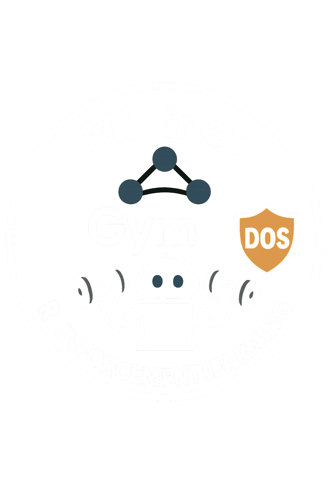

[![Contributors][contributors-shield]][contributors-url]
[![Forks][forks-shield]][forks-url]
[![Stargazers][stars-shield]][stars-url]
[![Issues][issues-shield]][issues-url]
[![MIT License][license-shield]][license-url]
[![LinkedIn][linkedin-shield]][linkedin-url]

 

  

  <h3 align="center">RL-Mininet-OpenDayLight</h3>

  

    Reinforcement learning Mininet OpenDayLight
    This project aims to provide a basic framework for DDoS mitigation using reinforcement learning (Deep and not). The network is implemented using Mininet (based on Software defined networking).

    The design of the solution is inspired by the work "???" by Salvo Finistrella and others here.
     
    <a href="https://github.com/finix77/MininetOpenDayLight"><strong>Explore the docs »</strong></a>
     
     
    <a href="https://github.com/finix77/MininetOpenDayLight">View Demo</a>
    ·
    <a href="https://github.com/finix77/MininetOpenDayLight/issues/new?labels=bug&template=bug-report---.md">Report Bug</a>
    ·
    <a href="https://github.com/finix77/MininetOpenDayLight/issues/new?labels=enhancement&template=feature-request---.md">Request Feature</a>
  

<!-- TABLE OF CONTENTS -->

  
Table of Contents

  <ol>
    <li>
      <a href="#about-the-project">About The Project</a>
      <ul>
        <li><a href="#built-with">Built With</a></li>
      </ul>
    </li>
    <li>
      <a href="#getting-started">Getting Started</a>
      <ul>
        <li><a href="#prerequisites">Prerequisites</a></li>
        <li><a href="#installation">Installation</a></li>
      </ul>
    </li>
    <li><a href="#usage">Usage</a></li>
    <li><a href="#roadmap">Roadmap</a></li>
    <li><a href="#contributing">Contributing</a></li>
    <li><a href="#license">License</a></li>
    <li><a href="#contact">Contact</a></li>
    <li><a href="#acknowledgments">Acknowledgments</a></li>
  </ol>

<!-- ABOUT THE PROJECT -->
## About The Project

[![Product Screen Shot][product-screenshot]]
[![Schema Screen Shot][schema-screenshot]]

    Reinforcement learning Mininet OpenDayLight

(<a href="#readme-top">back to top</a>)

## Getting Started
  Reinforcement learning Mininet OpenDayLight

### Prerequisites
Python 3.11
OpenDayLight
Java
Mininet [Mininet and OpenVSwitch]

### Installation
Per installare controller ODL su Ubuntu 22 seguire [ODL-Ubuntu22-installation]
versione ODL karaf 0.8.4 [ODL-karaf-0.8.4]
versione java 1.8.0
echo 'export JAVA_PATH=/usr/lib/jvm/java-21-openjdk-amd64/bin/java' 

Creare il venv
#python3 -m venv MYenv11
virtualenv --python="/usr/bin/python3.11" "MYenv11"  [use-different-python-version-with-virtualenv]
Attivare il venv
source MYenv11/bin/activate

install requirements.txt

--------------------------------------------

2 - Other notes

Lista container
docker ps -a

Per avviare container controller Opendaylight
docker run -d -t -v ~/.m2:/root/.m2/ -p 6633:6633 -p 8101:8101 -p 8181:8181 --net=bridge --hostname=ovsdb-cluster-node-1 --name=opendaylight opendaylight/opendaylight:0.18.2
https://github.com/sfuhrm/docker-opendaylight

Per connettersi in SSH al controller opendaylight 
in container docker su macchina virtuale 192.168.1.226
ssh -o StrictHostKeyChecking=no -o UserKnownHostsFile=/dev/null -p 8101 karaf@192.168.1.226
password karaf
https://brianlinkletter.com/2016/02/using-the-opendaylight-sdn-controller-with-the-mininet-network-emulator/

tutte le release https://nexus.opendaylight.org/content/repositories/opendaylight.release/org/opendaylight/integration/karaf/

(<a href="#readme-top">back to top</a>)

<!-- USAGE EXAMPLES -->
## Usage

To avoid gym not found 
sudo ..../MininetOpenDayLight/MYenv11/bin/python main.py

or better, go into venv with the command 'source MYenv11/bin/activate'

Create and modify `config.yaml` starting from `base_config.yaml`.
One model (agent) is mandatory.

(<a href="#readme-top">back to top</a>)

<!-- ROADMAP -->
## Roadmap

- [x] Mininet network generation
- [x] Open day light controller connected
- [x] Generation of traffic like PING, UDP, TCP 
- [x] Introduction of Reinforcmente learning algorithms to detect traffic: QLearning, Sarsa 
- [x] Plot metrics and other statistics
- [x] Comparering results with supervised learning (Decision tree calssification)
- [ ] Deep learning
    - [ ] DQN
    - [ ] A2C
    - [ ] PPO
- [ ] Generation traffic real time, short and long time DDOS
- [ ] Introduction of MARL

See the [open issues](https://github.com/othneildrew/Best-README-Template/issues) for a full list of proposed features (and known issues).

(<a href="#readme-top">back to top</a>)

<!-- CONTRIBUTING -->
## Contributing

Contributions are what make the open source community such an amazing place to learn, inspire, and create. Any contributions you make are **greatly appreciated**.

If you have a suggestion that would make this better, please fork the repo and create a pull request. You can also simply open an issue with the tag "enhancement".
Don't forget to give the project a star! Thanks again!

1. Fork the Project
2. Create your Feature Branch (`git checkout -b feature/AmazingFeature`)
3. Commit your Changes (`git commit -m 'Add some AmazingFeature'`)
4. Push to the Branch (`git push origin feature/AmazingFeature`)
5. Open a Pull Request

### Top contributors:

<a href="https://github.com/finix77/MininetOpenDayLight/graphs/contributors">
  top
</a>

(<a href="#readme-top">back to top</a>)

<!-- LICENSE -->
## License

Distributed under the MIT License. See `LICENSE.txt` for more information.

(<a href="#readme-top">back to top</a>)

<!-- CONTACT -->
## Contact

Salvo Finistrella - [@Linkedin](https://www.linkedin.com/in/salvo-finistrella-03083540) - salvo.finistrella@unimore.com

Project Link: [https://github.com/finix77/MininetOpenDayLight/](https://github.com/finix77/MininetOpenDayLight)

(<a href="#readme-top">back to top</a>)

<!-- ACKNOWLEDGMENTS -->
## Acknowledgments

Use this space to list resources you find helpful and would like to give credit to. I've included a few of my favorites to kick things off!

* [Choose an Open Source License](https://choosealicense.com)
* [GitHub Emoji Cheat Sheet](https://www.webpagefx.com/tools/emoji-cheat-sheet)
* [Malven's Flexbox Cheatsheet](https://flexbox.malven.co/)
* [Malven's Grid Cheatsheet](https://grid.malven.co/)
* [Img Shields](https://shields.io)
* [GitHub Pages](https://pages.github.com)
* [Font Awesome](https://fontawesome.com)
* [React Icons](https://react-icons.github.io/react-icons/search)

(<a href="#readme-top">back to top</a>)

[contributors-shield]: https://img.shields.io/github/contributors/othneildrew/Best-README-Template.svg?style=for-the-badge
[contributors-url]: https://github.com/finix77/MininetOpenDayLight//graphs/contributors
[forks-shield]: https://img.shields.io/github/forks/othneildrew/Best-README-Template.svg?style=for-the-badge
[forks-url]: https://github.com/finix77/MininetOpenDayLight/network/members
[stars-shield]: https://img.shields.io/github/stars/othneildrew/Best-README-Template.svg?style=for-the-badge
[stars-url]: https://github.com/finix77/MininetOpenDayLight/stargazers
[issues-shield]: https://img.shields.io/github/issues/othneildrew/Best-README-Template.svg?style=for-the-badge
[issues-url]: https://github.com/finix77/MininetOpenDayLight/issues
[license-shield]: https://img.shields.io/github/license/othneildrew/Best-README-Template.svg?style=for-the-badge
[license-url]: https://github.com/othneildrew/Best-README-Template/blob/master/LICENSE.txt
[ODL-karaf-0.8.4]: https://nexus.opendaylight.org/content/repositories/opendaylight.release/org/opendaylight/integration/karaf/0.8.4/karaf-0.8.4.zip
[ODL-Ubuntu22-installation]: https://john.soban.ski/install-opendaylight-ubuntu-lts-22-04.html
[Mininet and OpenVSwitch]: http://mininet.org/ - Custom switch for SDN and Mininet
[linkedin-shield]: https://img.shields.io/badge/-LinkedIn-black.svg?style=for-the-badge&logo=linkedin&colorB=555
[linkedin-url]: https://www.linkedin.com/in/salvo-finistrella-03083540/
[use-different-python-version-with-virtualenv]: https://stackoverflow.com/questions/1534210/use-different-python-version-with-virtualenv
[product-screenshot]: images/screenshot.png
[schema-screenshot]: images/schema.png
